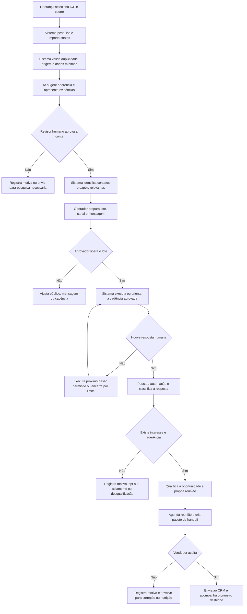
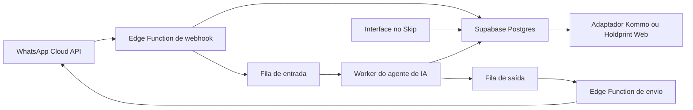

# Escopo Definitivo do Sistema de Prospecção e Desenvolvimento de Contas B2B

## 1 Contexto e decisão de escopo

A SV Impressão Digital precisa aumentar de forma previsível a entrada de novas oportunidades comerciais. A empresa possui capacidade produtiva, cinco vendedores, carteira recorrente e experiência em projetos de comunicação visual de maior complexidade, mas ainda depende de indicações e de uma prospecção manual com baixo retorno.

O primeiro projeto será uma máquina de prospecção B2B para identificar empresas aderentes ao perfil da SV, localizar contatos relevantes, apoiar abordagens, executar cadências controladas e entregar oportunidades qualificadas aos vendedores. O sistema deverá tornar o processo mensurável e repetível sem prometer fechamento automático nem substituir o julgamento comercial.

A reunião de validação do escopo definiu quatro limites centrais:

1. O foco é prospectar novos clientes, não reativar a base atual.
2. O sistema não substituirá o Kommo nem criará um novo CRM completo, porque o Holdprint Web está em implantação e deverá incorporar CRM e ERP.
3. O sistema cobrirá o processo desde a definição do perfil de cliente ideal até a reunião agendada e o handoff ao vendedor.
4. Toda cadência externa terá controle humano, com aprovação de público, mensagem e canal antes do envio.

O projeto será construído como um sistema próprio de prospecção no Skip, usando o Supabase como backend central. O Supabase concentrará banco de dados, autenticação, permissões, auditoria, webhooks, filas e funções de integração. A WhatsApp Cloud API será o canal principal do agente de qualificação. O Ethos apoiará a implementação e, nas fases avançadas, operará agentes e rotinas assistidas. O desenho funcional será independente do CRM de destino para permitir que o handoff ocorra primeiro no Kommo e, quando a migração estiver pronta, no Holdprint Web.

## 2 Resultado de negócio

O sistema deverá transformar a prospecção em um canal recorrente de geração de oportunidades para contas de médio e grande porte, reduzindo a dependência de indicação e permitindo que a liderança identifique onde a aquisição perde eficiência.

### 2.1 Resultado principal

Gerar um fluxo previsível de novas oportunidades B2B qualificadas e reuniões comerciais, com origem, critérios de aderência, histórico de contatos, responsável e desfecho registrados.

### 2.2 Indicadores de sucesso

Os indicadores abaixo são as metas operacionais iniciais do projeto. A primeira fase confirmará o ponto de partida e manterá visível qualquer diferença de definição ou cobertura dos dados.

| Indicador | Meta inicial | Regra de medição |
|---|---:|---|
| Oportunidades qualificadas por mês | pelo menos 40 | Conta que atende ao ICP, possui contato válido, sinal ou necessidade relevante e foi aceita para abordagem ou continuidade comercial |
| Conversão de oportunidade qualificada em reunião válida | pelo menos 25% | Reunião realizada ou confirmada com participante aderente ao papel decisor ou influenciador definido |
| Reuniões qualificadas geradas por mês | pelo menos 10 | Reuniões oriundas da prospecção ativa e registradas com conta, contato, vendedor e data |
| Participação da prospecção ativa nas novas oportunidades | pelo menos 80% | Oportunidades novas cuja origem registrada é prospecção ativa, excluindo indicação, mídia paga e demanda espontânea |
| Cobertura de responsável e próximo passo | 100% | Todo registro ativo deve ter responsável e próxima ação com prazo, ou uma exceção justificada |
| Rastreabilidade de dados e contatos | 100% | Toda conta contatada deve possuir fonte, data de coleta, aprovador do lote e histórico de ações |
| Respeito a pausa e opt out | 100% | Nenhum contato pode continuar após pedido de interrupção ou bloqueio manual |

O fechamento de vendas e a receita atribuída serão acompanhados, mas não serão o único critério de aceite do ciclo. As contas desejadas podem ter ciclos comerciais longos, inclusive de um a dois anos.

### 2.3 Referência inicial disponível

O material fornecido mostra uma fotografia de 240 leads, dos quais 84 estavam no estágio “Encaminhado ao vendedor”. Outro documento relata aproximadamente 85 contatos qualificados e encaminhados, sem negócio fechado até então, além de 40 a 50 contas ainda em prospecção. Essa referência deverá ser importada ou reconciliada na primeira fase, sem presumir que “encaminhado” já equivale a oportunidade qualificada ou reunião válida.

## 3 Público e responsabilidades

| Ator | Responsabilidade no sistema |
|---|---|
| Patrocinador e liderança comercial | Aprovar ICP, metas, canais, capacidade de atendimento e mudanças nas regras comerciais |
| Champion do projeto | Administrar o sistema, coordenar dados e acessos, acompanhar a implantação e consolidar dúvidas com a Adapta |
| Profissional de prospecção | Pesquisar contas, validar dados, revisar recomendações, operar cadências e qualificar respostas |
| Vendedores | Aceitar ou recusar oportunidades com motivo, realizar reunião e registrar o primeiro desfecho comercial |
| Administrador técnico | Manter conectores, credenciais corporativas, permissões, exportações e transição entre CRM atual e futuro |
| Agentes de IA | Pesquisar, organizar, sugerir, classificar e monitorar conforme regras; nunca assumir compromissos comerciais nem executar contatos fora de lotes aprovados |

## 4 Fronteira do sistema

### 4.1 Início do fluxo

O fluxo começa com a escolha de um segmento ou recorte de ICP para prospecção.

### 4.2 Fim do fluxo

O fluxo termina quando ocorre uma destas situações:

- reunião qualificada agendada e oportunidade entregue ao vendedor;
- oportunidade aceita pelo vendedor para continuidade no CRM;
- conta desqualificada com motivo;
- contato inválido ou sem resposta após a cadência aprovada;
- pedido de não contato ou bloqueio;
- adiamento com data e razão registradas.

### 4.3 Sistemas e fontes

| Domínio | Fonte ou destino durante o projeto |
|---|---|
| Pesquisa e pré qualificação | Sistema de Prospecção B2B |
| Histórico de cadência e respostas antes do handoff | Sistema de Prospecção B2B |
| Dados, autenticação, filas, webhooks e auditoria | Supabase |
| Conversas de prospecção e qualificação | WhatsApp Cloud API conectada ao backend Supabase |
| Oportunidade aceita e continuidade do vendedor | Kommo enquanto for o CRM operacional |
| Destino futuro do CRM e dados operacionais | Holdprint Web após confirmação de disponibilidade e capacidade |
| Dados públicos e enriquecimento | Fontes autorizadas como sites institucionais, Google Maps, bases públicas de CNPJ e ferramentas contratadas pela SV, respeitando suas regras de uso |
| Pesquisa profissional | LinkedIn ou ferramenta equivalente, sem assumir acesso automatizado não autorizado |
| Contato externo | Canal corporativo aprovado pela SV, com conector e credencial próprios |

O sistema deverá usar uma camada de integração substituível. A mudança do Kommo para o Holdprint Web não poderá exigir a reconstrução do processo de prospecção. O Skip não armazenará credenciais de integração nem executará diretamente operações privilegiadas; essas ações ocorrerão em funções server-side do Supabase.

## 5 Perfil de cliente ideal inicial

O piloto começará por um recorte em que a SV já possui experiência e evidência comercial.

### 5.1 Segmento prioritário

- redes de supermercados e mercados em expansão;
- redes varejistas com várias unidades e demanda recorrente de fachada, sinalização, ambientação ou implantação de pontos de venda;
- empresas de médio e grande porte com múltiplas unidades;
- atuação inicial no Rio Grande do Sul e em Santa Catarina, com expansão controlada para o Centro Oeste quando houver capacidade comercial.

O sistema deverá permitir que a liderança crie outros perfis no futuro sem alterar sua estrutura.

### 5.2 Sinais de aderência

- quantidade de unidades ou presença regional;
- inauguração, reforma, expansão ou mudança de identidade visual;
- abertura de novas lojas, filiais ou centros de operação;
- recorrência provável de demandas de comunicação visual;
- porte compatível com projetos de maior valor;
- presença de área de expansão, marketing, trade marketing, obras, infraestrutura, suprimentos ou compras;
- compatibilidade geográfica e operacional com a capacidade da SV.

### 5.3 Evidências obrigatórias

Cada classificação deverá exibir os dados que sustentam a decisão. Quando a informação não estiver disponível, o sistema deverá marcar “pesquisa necessária” em vez de inventar ou completar o dado por inferência.

A identificação do fornecedor atual de comunicação visual não fará parte da qualificação obrigatória. Esse dado só poderá aparecer quando houver fonte pública ou informação fornecida pela própria conta; o sistema não deverá prometer descobri-lo de forma automática.

## 6 Fluxo futuro

## 7 Capacidades funcionais

### 7.1 Configuração de ICP

O sistema permitirá criar e versionar perfis com segmento, porte, região, quantidade de unidades, sinais comerciais, impedimentos, pesos e critérios mínimos. Cada coorte ficará vinculada à versão do ICP usada em sua criação.

### 7.2 Pesquisa e cadastro de contas

O operador poderá pesquisar, importar ou cadastrar empresas. Para cada conta, o sistema deverá guardar nome, CNPJ quando disponível, site, setor, porte, região, unidades, sinais encontrados, fonte, data da coleta e responsável pela última validação.

### 7.3 Enriquecimento e contatos

O sistema reunirá contatos profissionais relevantes, com nome, cargo ou papel, canal disponível, origem do dado, confiança e data de verificação. Dados insuficientes ou conflitantes ficarão visíveis para revisão.

### 7.4 Pontuação explicável

A IA poderá sugerir uma pontuação de aderência e prioridade, mas deverá apresentar as razões e evidências. A aprovação final da conta será humana. Alterações nos critérios não poderão reescrever silenciosamente o histórico de coortes anteriores.

### 7.5 Gestão de coortes e listas

As contas serão organizadas por coorte, segmento, região, responsável e estágio. O sistema deverá evitar duplicidades e impedir que a mesma conta receba cadências concorrentes.

### 7.6 Biblioteca de mensagens

O sistema manterá modelos por segmento, papel e canal. A IA poderá adaptar a mensagem usando somente fatos disponíveis sobre a empresa, sem inventar clientes, números, cases, certificações, preços ou capacidade de entrega.

### 7.7 Aprovação de lotes

Antes do contato, um aprovador deverá revisar público, mensagem, canal, volume, frequência e limite de tentativas. A aprovação ficará registrada com usuário, data e versão do conteúdo.

### 7.8 Cadência controlada

O sistema executará ou orientará os contatos previstos, registrará tentativas e criará o próximo passo permitido. Resposta humana, erro crítico, bloqueio manual ou opt out pausará imediatamente a sequência.

### 7.9 Caixa de respostas e classificação

As respostas serão centralizadas ou registradas no sistema e classificadas em interesse, pedido de informação, encaminhamento, momento futuro, sem interesse, contato incorreto, resposta automática ou opt out. Classificações de alta consequência exigirão confirmação humana.

### 7.10 Qualificação e reunião

O operador registrará necessidade, contexto, potencial, momento, interlocutor, objeções e próximo passo. A reunião somente contará como válida quando possuir conta, participante, vendedor, data e objetivo.

### 7.11 Handoff ao vendedor

O pacote de handoff deverá conter:

- identificação e resumo da conta;
- razões de aderência ao ICP;
- contatos e papéis envolvidos;
- fontes e sinais relevantes;
- histórico da cadência e respostas;
- necessidade ou oportunidade identificada;
- reunião e próximos passos;
- responsável pela prospecção;
- versão do ICP e da mensagem utilizada.

O vendedor deverá aceitar ou recusar com motivo. O aceite criará ou atualizará o registro no CRM sem duplicar a oportunidade.

### 7.12 Painel de aquisição

O painel mostrará, por período, coorte, segmento, origem e responsável:

- contas pesquisadas e aprovadas;
- contatos válidos;
- tentativas realizadas;
- respostas humanas e taxa de resposta;
- oportunidades qualificadas;
- oportunidades aceitas pelos vendedores;
- reuniões válidas;
- orçamentos, ganhos e perdas quando retornarem do CRM;
- tempo entre etapas;
- motivos de desqualificação, recusa e perda;
- cobertura e qualidade dos dados;
- comparação entre versões de ICP, mensagem e cadência.

### 7.13 Administração e auditoria

O sistema terá permissões por papel, histórico de alterações críticas, revogação de acesso, transferência de carteira e trilha de aprovações. Credenciais de conectores não deverão aparecer para usuários comuns nem ser incorporadas a prompts, documentos ou código.

### 7.14 Agente de qualificação no WhatsApp

O agente receberá mensagens por webhook da WhatsApp Cloud API, consultará o contexto no Supabase e conduzirá a qualificação dentro de um roteiro aprovado. O webhook deverá responder rapidamente ao provedor e encaminhar o processamento para uma fila persistente; nenhuma chamada demorada ao modelo de IA ocorrerá dentro da recepção do webhook.

O agente poderá esclarecer dúvidas institucionais autorizadas, coletar dados de qualificação, identificar interesse, sugerir reunião e encaminhar a conversa para uma pessoa. Não poderá negociar preço, confirmar prazo, enviar proposta, assumir compromisso comercial ou continuar quando houver opt out, bloqueio, solicitação humana ou baixa confiança.

Cada conversa manterá estado explícito: `nova`, `em_qualificacao`, `aguardando_humano`, `em_atendimento_humano`, `reuniao_proposta`, `concluida`, `sem_interesse` ou `opt_out`. A transferência humana bloqueará novas respostas automáticas até liberação expressa.

## 8 Regras de negócio

1. Toda conta contatada deve estar vinculada a uma coorte e a uma versão de ICP.
2. Toda conta deve ter fonte e data de coleta; ausência de fonte impede o contato.
3. A pontuação de IA é uma recomendação explicável, não uma decisão final.
4. Nenhum lote pode iniciar sem aprovador, canal, mensagem, limite de volume e limite de tentativas.
5. A personalização só pode usar dados registrados e verificáveis.
6. A mesma conta não pode participar de duas cadências simultâneas.
7. Uma resposta humana pausa os próximos envios até classificação.
8. Opt out, bloqueio ou pedido de interrupção encerra os contatos futuros naquele canal conforme a política definida pela SV.
9. Resposta automática, bounce e falha técnica não contam como resposta humana.
10. Toda oportunidade qualificada deve ter responsável, próximo passo e prazo.
11. O vendedor deve aceitar ou recusar o handoff; a recusa exige motivo.
12. A ausência de resposta do vendedor gera alerta à liderança, não descarte automático.
13. O sistema não pode prometer preço, prazo de produção, condição comercial ou capacidade sem ação humana.
14. A criação ou atualização no CRM deve ser idempotente e preservar o identificador de origem.
15. Mudanças de regras devem valer para novas execuções e manter o histórico das anteriores.
16. Todo evento recebido do WhatsApp deve ser persistido uma única vez pelo identificador do provedor ou por uma chave de idempotência derivada.
17. O webhook do WhatsApp não executa o agente diretamente; ele valida, registra, enfileira e responde ao provedor.
18. Mensagens de saída são enviadas por fila e mantêm vínculo com conversa, aprovação, modelo de mensagem e tentativa.
19. A transferência para atendimento humano suspende o agente até uma retomada explícita.
20. Credenciais do WhatsApp, Supabase e modelos de IA permanecem somente em secrets server-side.

## 9 Dados principais

| Entidade | Campos mínimos |
|---|---|
| ICP | nome, versão, segmento, porte, região, sinais, impedimentos, pesos, aprovador, vigência |
| Conta | nome, CNPJ quando disponível, site, setor, porte, região, unidades, sinais, origem, data de verificação, status |
| Contato | nome, papel, empresa, canal, origem, confiança, data de verificação, preferência de contato |
| Coorte | objetivo, ICP, período, volume, responsáveis, canais, status e critérios de encerramento |
| Cadência | etapas, intervalos, canal, mensagens, limite de tentativas, versão, aprovador |
| Interação | data, canal, direção, conteúdo ou resumo, resultado, operador e próxima ação |
| Oportunidade | conta, contato, aderência, necessidade, estágio, proprietário, valor quando conhecido e origem |
| Reunião | data, participantes, objetivo, vendedor, status e resultado inicial |
| Handoff | pacote enviado, destino, identificador no CRM, aceite, recusa, motivo e prazos |
| Consentimento e bloqueio | canal, tipo de restrição, data, origem e responsável pelo registro |
| Evento de auditoria | usuário ou agente, ação, data, objeto, versão, resultado e justificativa quando aplicável |
| Conversa WhatsApp | conta, contato, número normalizado, estado, responsável, modo automático ou humano e última interação |
| Mensagem WhatsApp | identificador do provedor, direção, tipo, conteúdo permitido, status, timestamps, erro e chave de idempotência |
| Execução do agente | conversa, versão do prompt, entradas recuperadas, decisão, confiança, ferramentas usadas, saída e escalonamento |
| Evento de integração | provedor, tipo, payload mínimo necessário, tentativas, próximo retry, status e erro sanitizado |

## 10 Integrações

### 10.1 Integrações previstas

- fonte autorizada de dados empresariais ou CNPJ;
- busca e enriquecimento contratado pela SV, quando houver acesso;
- canal corporativo de e-mail ou outro canal aprovado;
- WhatsApp Cloud API, com número corporativo, aplicação Meta e templates aprovados quando exigidos pelo canal;
- agenda corporativa para disponibilidade e registro de reuniões;
- Kommo para o handoff durante a operação atual;
- Holdprint Web como destino futuro, condicionado à disponibilidade de API, ambiente e modelo de dados;
- exportação CSV como contingência para listas e handoffs.

### 10.2 Princípios de integração

- cada domínio terá uma fonte oficial durante cada período;
- o sistema de prospecção será a fonte do histórico anterior ao aceite do vendedor;
- o CRM será a fonte da continuidade comercial após o aceite;
- a sincronização deverá registrar falhas e permitir repetição sem duplicar dados;
- nenhum conector será considerado disponível antes de teste com credencial e ambiente reais;
- a ausência de integração não bloqueará o piloto quando houver uma exportação manual segura e rastreável.

### 10.3 Arquitetura de referência

- **Skip:** interface de operação, configuração, revisão, aprovação e acompanhamento.
- **Supabase Postgres:** fonte de verdade das contas, contatos, coortes, conversas, mensagens, oportunidades e auditoria.
- **Supabase Auth e RLS:** autenticação e autorização por organização e papel.
- **Supabase Edge Functions:** webhooks públicos verificados e integrações server-side.
- **Supabase Queues:** processamento persistente de mensagens recebidas, respostas, tarefas de agente e sincronizações.
- **Agente de IA:** execução assíncrona, com prompt versionado, ferramentas limitadas e transferência humana.
- **WhatsApp Cloud API:** transporte oficial das mensagens.

O processamento deverá ser assíncrono. Se o agente, modelo de IA ou CRM estiver indisponível, a mensagem continuará registrada e será reprocessada conforme política de retry, sem duplicar resposta.

## 11 Evolução em cinco fases

As cinco fases formam uma única evolução do mesmo sistema. Cada fase deverá entregar uma capacidade utilizável e manter o que já foi aprovado nas fases anteriores.

### Fase 1 Fundação do processo e painel inicial

**Objetivo:** criar a base operacional que permita medir a prospecção e operar uma primeira coorte sem depender de um CRM novo.

**Capacidades do sistema:**

- autenticação e perfis de acesso;
- cadastro e versionamento do ICP;
- funil de pré vendas padronizado;
- cadastro ou importação de contas e contatos;
- estados, responsáveis, próximo passo e motivos de encerramento;
- painel inicial com volume, estágio, origem e cobertura de dados;
- importação ou reconciliação da fotografia atual de prospecção.
- projeto Supabase com migrações versionadas, autenticação, RLS, auditoria e filas básicas;

**Atores:** liderança comercial, Champion, profissional de prospecção e administrador.

**Dados:** ICP, contas, contatos, estágios, fontes, usuários e referência dos 240 leads fornecidos.

**Integrações:** Supabase como backend, importação CSV e exportação de segurança. Nenhuma integração definitiva com o CRM é necessária nesta fase.

**Regras:** nomes de clientes não serão etapas; registros ativos terão responsável e próximo passo; dados sem fonte ficarão bloqueados para contato.

**Entrega visível:** aplicação navegável com um ICP inicial, funil padronizado, base importada e painel de linha de partida.

**Critérios de aceite:**

- [ ] Usuários acessam apenas as funções de seus papéis.
- [ ] O ICP prioritário pode ser criado e versionado.
- [ ] Contas e contatos podem ser importados sem duplicação silenciosa.
- [ ] Todo registro ativo exibe responsável, estágio e próximo passo ou exceção.
- [ ] O painel diferencia dado ausente de valor zero.
- [ ] A referência atual de prospecção está reconciliada ou registrada como base separada com suas limitações.
- [ ] As tabelas críticas possuem RLS, trilha de auditoria e testes de isolamento entre papéis.

### Fase 2 Inteligência de contas e construção de listas

**Objetivo:** transformar o ICP em listas priorizadas de empresas com evidências suficientes para revisão humana.

**Capacidades do sistema:**

- pesquisa e enriquecimento por segmento, porte, região e número de unidades;
- captura de sinais como expansão, inauguração e reforma;
- localização de papéis profissionais relevantes;
- pontuação explicável de aderência;
- fila de pesquisa necessária;
- deduplicação e controle de coortes;
- revisão e aprovação humana da lista.

**Atores:** profissional de prospecção, liderança comercial e Champion.

**Dados:** contas alvo, CNPJ quando disponível, sites, unidades, sinais, contatos, fontes e evidências.

**Integrações:** fontes públicas ou contratadas e pesquisa web autorizada. Conectores serão usados somente dentro das condições de acesso da SV.

**Regras:** nenhuma conta será aprovada apenas pela pontuação; dados contraditórios ou insuficientes exigirão revisão; o fornecedor atual não será requisito.

**Entrega visível:** primeira coorte de redes de mercados ou varejistas multiunidade, priorizada e pronta para preparação de abordagem.

**Critérios de aceite:**

- [ ] Cada conta exibe sua aderência e as evidências usadas.
- [ ] A lista pode ser filtrada por segmento, região, porte, sinal, pontuação e responsável.
- [ ] Duplicidades são sinalizadas antes da aprovação.
- [ ] Contatos exibem papel, fonte e data de verificação.
- [ ] Contas sem informação suficiente entram em pesquisa necessária.
- [ ] Um revisor humano consegue aprovar, rejeitar ou devolver cada conta com motivo.

### Fase 3 Cadência controlada e handoff comercial

**Objetivo:** executar a prospecção de uma coorte aprovada e transformar interesse em reuniões e oportunidades entregues aos vendedores.

**Capacidades do sistema:**

- biblioteca de mensagens por segmento e papel;
- personalização assistida com fatos verificados;
- montagem e aprovação de lotes;
- cadência com limites de tentativas e intervalos configuráveis;
- registro de tentativas, respostas e erros;
- pausa por resposta, bloqueio ou opt out;
- qualificação da oportunidade;
- agendamento ou registro de reunião;
- pacote de handoff, aceite e recusa motivada;
- criação ou atualização no Kommo, com exportação manual como contingência.
- webhook, filas e histórico de conversas do WhatsApp;
- agente de qualificação com transferência humana;

**Atores:** profissional de prospecção, aprovador comercial, vendedor e administrador técnico.

**Dados:** mensagens, aprovações, interações, respostas, qualificação, reunião, handoff e identificador no CRM.

**Integrações:** Supabase, WhatsApp Cloud API, modelo de IA aprovado, agenda e Kommo ou exportação compatível.

**Regras:** não haverá envio fora de lote aprovado; respostas humanas pausam a cadência; IA não confirma preço, prazo ou proposta; o vendedor precisa aceitar ou recusar.

**Entrega visível:** uma coorte completa percorre lista aprovada, abordagem, resposta, qualificação, reunião e handoff ao vendedor.

**Critérios de aceite:**

- [ ] O aprovador visualiza público, conteúdo, canal, frequência e volume antes de liberar o lote.
- [ ] Cada tentativa e resposta fica vinculada à conta e ao contato corretos.
- [ ] Opt out e bloqueio impedem novos contatos.
- [ ] O sistema diferencia resposta humana, resposta automática, bounce e falha técnica.
- [ ] A oportunidade qualificada gera um pacote de handoff completo.
- [ ] O vendedor aceita ou recusa com motivo e prazo mensurável.
- [ ] A criação repetida no CRM não duplica a oportunidade.
- [ ] O recebimento repetido do mesmo evento do WhatsApp não duplica mensagem nem resposta.
- [ ] A transferência humana impede novas respostas do agente até a retomada autorizada.

### Fase 4 Operação assistida por agentes e loops

**Objetivo:** reduzir o esforço operacional repetitivo depois que ICP, fontes, mensagens e cadência já tiverem sido testados por pessoas.

**Capacidades adicionais do sistema:**

- fila unificada de exceções e aprovações;
- agenda de rotinas recorrentes;
- monitoramento de contas sem responsável, próximo passo ou dado mínimo;
- sugestões de priorização com base no desempenho das coortes;
- recomendações de ajuste de mensagem e cadência;
- comparação de desempenho por ICP, segmento, papel e canal.

**Loops e agentes candidatos:**

| Loop ou agente | Função | Meta | Validação humana |
|---|---|---|---|
| Agente de pesquisa de contas | Busca novas contas e reúne evidências conforme o ICP vigente | reduzir o tempo de preparação de listas sem perder proveniência | aprovar ou rejeitar cada conta antes do contato |
| Agente de enriquecimento | Completa campos, identifica contatos e sinaliza conflitos | aumentar a cobertura de dados válidos | confirmar dados de confiança baixa ou conflitantes |
| Agente de priorização | Sugere ordem de trabalho e explica os sinais usados | concentrar esforço em contas com maior aderência | liderança aprova pesos e revisa mudanças |
| Copiloto de mensagem | Produz rascunhos usando a biblioteca e os fatos registrados | reduzir tempo de redação e manter consistência | operador revisa e aprovador libera o lote |
| Agente de triagem de respostas | Classifica respostas e sugere próximo passo | reduzir tempo até a ação correta | humano confirma interesse, desqualificação e opt out quando houver ambiguidade |
| Loop de integridade do funil | Procura registros sem dono, prazo, fonte ou próximo passo | manter 100% de cobertura operacional | responsáveis corrigem ou justificam a exceção |

**Atores:** mesmos atores das fases anteriores, com agentes operando sob permissões próprias e ações atribuíveis.

**Dados:** histórico validado das três primeiras fases, versões de regras, eventos de agente, confiança e decisão humana.

**Integrações:** Ethos, sistema no Skip, Supabase, WhatsApp Cloud API e conectores já testados. Novas fontes ou canais exigirão configuração explícita.

**Regras:** agentes não ampliam volume, alteram ICP, ativam canal ou publicam mensagem sem autorização; toda ação deve ser rastreável e reversível quando tecnicamente possível.

**Entrega visível:** rotina semanal de prospecção assistida em que agentes preparam trabalho, humanos decidem e o sistema registra o resultado.

**Critérios de aceite:**

- [ ] Cada agente possui função, dados permitidos e ações proibidas definidos.
- [ ] Sugestões exibem evidências ou razão suficiente para revisão.
- [ ] Ações externas continuam vinculadas a aprovação humana.
- [ ] Falhas de conector entram em fila de exceção e podem ser repetidas sem duplicidade.
- [ ] O loop de integridade detecta registros incompletos e mede sua correção.
- [ ] A operação assistida reduz trabalho manual sem reduzir a qualidade dos dados ou aumentar contatos indevidos.

### Fase 5 Otimização escala controlada e validação ponta a ponta

**Objetivo:** consolidar o sistema, ampliar somente o que demonstrou resultado e validar todo o fluxo das fases 1 a 5.

**Capacidades adicionais do sistema:**

- painel executivo consolidado e comparativo entre coortes;
- testes controlados de ICP, mensagem, papel e cadência;
- recomendação de continuar, ajustar, pausar ou encerrar uma coorte;
- expansão para um segundo recorte de contas quando a capacidade dos vendedores permitir;
- conector ou plano de transição para o Holdprint Web, sem interromper o histórico;
- exportação completa e recuperação operacional;
- monitoramento contínuo de dados, integrações e adoção.

**Loops e agentes candidatos:**

| Loop ou agente | Função | Meta | Validação humana |
|---|---|---|---|
| Loop de aprendizado de coorte | Compara versões de ICP, lista, mensagem e cadência | identificar qual combinação gera mais oportunidades e reuniões válidas | liderança decide qualquer mudança de regra ou escala |
| Agente supervisor de exceções | Consolida falhas de dados, integração, SLA e permissão | reduzir incidentes sem ocultar erros | administrador resolve ou encaminha cada exceção crítica |
| Loop de capacidade comercial | Compara geração de oportunidades com aceite e atendimento dos vendedores | impedir que a prospecção exceda a capacidade de absorção | liderança define limite de volume por período |
| Agente de resumo executivo | Produz síntese periódica baseada nos indicadores do sistema | acelerar análise sem criar números ou conclusões não sustentadas | gestor revisa o resumo antes de distribuí-lo |

**Atores:** patrocinador, liderança comercial, Champion, profissional de prospecção, vendedores e administrador técnico.

**Dados:** todas as entidades, eventos, versões, métricas e decisões produzidas nas cinco fases.

**Integrações:** fontes de pesquisa, canal corporativo, agenda, CRM atual e, se disponível, Holdprint Web.

**Regras:** escala depende simultaneamente de qualidade, taxa de resposta, qualificação, aceite dos vendedores, reuniões e capacidade operacional; volume isolado não justifica expansão.

**Entrega visível:** sistema operando com dados reais, uma coorte completa validada, painel de resultado, loops supervisionados e caminho documentado de continuidade no CRM futuro.

**Critérios de aceite:**

- [ ] As metas e resultados são calculados por coorte, origem e período.
- [ ] O painel mostra cobertura de dados junto aos indicadores.
- [ ] A equipe consegue comparar ao menos duas versões ou coortes sem misturar seus históricos.
- [ ] O limite de operação respeita a capacidade declarada dos vendedores.
- [ ] O histórico pode ser exportado e restaurado sem perda dos identificadores principais.
- [ ] A troca de destino entre Kommo e Holdprint Web pode ocorrer por configuração ou adaptação do conector, sem reconstruir o núcleo da prospecção.
- [ ] A validação transversal abaixo foi concluída com evidência.

## 12 Matriz de validação transversal

| Área validada | Fase de origem | Evidência esperada na fase 5 |
|---|---:|---|
| ICP e regras de qualificação | 1 | versões preservadas, contas classificadas e motivos visíveis |
| Funil e linha de partida | 1 | responsáveis, próximos passos, origens e cobertura mensuráveis |
| Pesquisa e enriquecimento | 2 | fontes, datas, conflitos e decisões humanas rastreáveis |
| Listas e coortes | 2 | ausência de duplicidade silenciosa e histórico separado por versão |
| Mensagens e aprovações | 3 | conteúdo, aprovador, canal, público e versão recuperáveis |
| Cadência | 3 | tentativas, pausas, erros, respostas e opt outs corretos |
| Qualificação e reunião | 3 | critérios aplicados e reuniões válidas comprováveis |
| Handoff e CRM | 3 | pacote completo, aceite ou recusa e criação idempotente |
| Agentes e loops | 4 e 5 | permissões, logs, confiança, decisão humana e tratamento de falhas |
| Métricas | 1 a 5 | valores, definições, fonte, período e cobertura consistentes |
| Segurança e acesso | 1 a 5 | papéis, revogações e ações críticas atribuíveis |
| Continuidade tecnológica | 1 a 5 | exportação, recuperação e troca de conector demonstradas |

## 13 Fora de escopo

Não fazem parte deste projeto:

- criar um CRM completo ou substituir o Kommo e o Holdprint Web;
- redesenhar toda a operação comercial após o handoff ao vendedor;
- reativar automaticamente a carteira atual de clientes;
- modelar Produção, Instalação, faturamento, pagamento ou comissão;
- emitir orçamento, proposta, pedido ou nota fiscal;
- calcular preço, prazo de fabricação ou condição financeira;
- garantir identificação do fornecedor atual de uma conta;
- executar disparos irrestritos ou contatos sem aprovação humana;
- adquirir bases, contratar ferramentas ou consumir serviços pagos sem decisão da SV;
- automatizar coleta em fonte cujo contrato ou regra de uso não permita;
- reformular site, redes sociais, tráfego pago ou estratégia ampla de marketing;
- implantar programa de parcerias com associações comerciais; essa hipótese poderá ser testada futuramente como nova origem de contas;
- prometer vendas ou faturamento dentro do ciclo do projeto.

## 14 Requisitos não funcionais

### 14.1 Segurança e privacidade

- acesso mínimo por papel;
- autenticação individual e revogação de contas;
- credenciais armazenadas fora de código e prompts;
- trilha de ações críticas de usuários e agentes;
- coleta somente dos dados necessários ao processo;
- registro de origem e uso permitido dos dados;
- capacidade de bloquear contato e atender correção ou remoção conforme a política definida pela SV;
- validação da política de dados e canais pela empresa antes da operação com dados reais.

### 14.2 Confiabilidade

- operações de integração repetíveis sem duplicação;
- falhas visíveis, com contexto e possibilidade de reprocessamento;
- backups ou exportações periódicas dos dados essenciais;
- histórico de versões de ICP, regras, mensagens e cadências;
- nenhuma perda silenciosa de interação ou handoff.

### 14.3 Usabilidade

- interface simples para operação diária por usuários sem formação técnica;
- filas claras de pesquisar, revisar, aprovar, responder e corrigir;
- filtros salvos por papel e responsável;
- explicações legíveis para pontuações e sugestões de IA;
- ações críticas com confirmação e resultado visível.

### 14.4 Desempenho e escala

- busca, filtros e painéis adequados ao volume das coortes em operação;
- processamento em lote com limites configuráveis;
- execução assíncrona para pesquisa e enriquecimento demorados;
- limites de volume por canal, coorte e período.

## 15 Critérios globais de aceite

O sistema será considerado aceito quando:

1. uma coorte real completar o fluxo de pesquisa, revisão, abordagem, resposta, qualificação, reunião e handoff;
2. cada contato externo puder ser associado a fonte, conta, coorte, mensagem, aprovador e operador ou agente;
3. nenhuma conta ativa permanecer sem responsável e próximo passo sem aparecer como exceção;
4. respostas, opt outs, falhas e bloqueios interromperem corretamente a cadência;
5. o vendedor puder aceitar ou recusar um handoff e receber todo o contexto necessário;
6. os indicadores forem calculados com definição, fonte, período e cobertura visíveis;
7. as permissões impedirem ações externas ou administrativas por usuários sem autorização;
8. o sistema continuar utilizável durante a transição do Kommo para o Holdprint Web;
9. os agentes das fases 4 e 5 permanecerem supervisionados, auditáveis e limitados às ações aprovadas;
10. a matriz transversal das cinco fases estiver validada.

## 16 Riscos e respostas

| Risco | Impacto | Resposta prevista |
|---|---|---|
| Dados públicos incompletos ou desatualizados | contato errado e baixa qualidade da lista | exibir fonte, data e confiança; exigir revisão para dados críticos |
| ICP amplo demais | alto volume com pouca aderência | iniciar por redes de mercados e varejo multiunidade; comparar coortes antes de expandir |
| Mensagem ou canal inadequado | baixa resposta e dano reputacional | aprovação humana, volume limitado, pausa rápida e análise por coorte |
| Equipe não absorve os leads | oportunidades paradas após o handoff | capacidade máxima por período, SLA de aceite e alerta à liderança |
| Migração do CRM muda durante o projeto | retrabalho de integração | separar núcleo de prospecção do adaptador do CRM e manter exportação de contingência |
| IA inventa informação | abordagem incorreta ou perda de confiança | permitir personalização apenas com fatos registrados e mostrar evidências |
| Agente executa ação indevida | contato não autorizado ou alteração de regra | permissões próprias, aprovação humana e auditoria de ações |
| Métricas misturam origens | atribuição incorreta do resultado | origem obrigatória, coortes separadas e cobertura de dados visível |
| Ciclo comercial longo | avaliação prematura pelo faturamento | priorizar oportunidades, aceites e reuniões como sinais antecedentes |
| Dependência de ferramenta externa | indisponibilidade ou custo não previsto | conectores substituíveis, exportação manual e validação antes de considerar integração pronta |
| Webhook duplicado ou fora de ordem | resposta repetida ou estado incorreto da conversa | idempotência por evento, ordenação por timestamp, fila persistente e reconciliação |
| Agente responde durante atendimento humano | conflito com vendedor e experiência ruim | bloqueio por estado de takeover e retomada somente por ação autorizada |
| Credencial privilegiada exposta no frontend | acesso indevido ao banco ou WhatsApp | secrets apenas server-side, RLS e proibição de service role no Skip |

## 17 Decisões consolidadas

| Tema | Decisão definitiva para este escopo |
|---|---|
| Promessa principal | máquina de prospecção e desenvolvimento de novas contas B2B |
| Segmento inicial | redes de mercados e varejistas multiunidade, começando por RS e SC |
| Reativação da base | fora do escopo atual |
| CRM | não será reconstruído; Kommo recebe handoffs enquanto estiver ativo |
| Holdprint Web | destino futuro provável, tratado por conector substituível após disponibilidade real |
| Limite do processo | ICP até reunião agendada e oportunidade entregue ao vendedor |
| Autonomia de contato | cadência controlada com aprovação humana |
| Qualificação por IA | recomendação explicável, com decisão humana |
| Fornecedor atual da conta | informação opcional, apenas quando houver fonte confiável |
| Pós venda, Produção e Financeiro | fora do escopo funcional |
| Métrica principal | reuniões qualificadas geradas pela prospecção ativa |
| Arquitetura de implementação | Skip no frontend; Supabase no backend; WhatsApp Cloud API como canal; Ethos e agentes supervisionados na camada de inteligência |
| Processamento do agente | assíncrono por filas; webhook apenas valida, persiste e enfileira |

## 18 Fontes consolidadas

- reunião de validação do escopo entre Kimberly Prestes e Diego Cunha;
- `03-Projeto/00-DMO.md`;
- `03-Projeto/01-Escopo.md`;
- `03-Projeto/direcoes.md`;
- `03-Projeto/requisitos.md`;
- `03-Projeto/revisao-do-escopo.md`;
- `03-Projeto/analise-critica.md`;
- `03-Projeto/conselho-de-decisao.md`;
- `02-Reuniao/Kickoff Call/01-transcricao.md`;
- `02-Reuniao/Sales Call/01-transcricao.md`;
- `04-Mapeamento-Processos/00-Contexto/sv digital.pdf`;
- `04-Mapeamento-Processos/00-Contexto/SV Digital (1).pdf`;
- `04-Mapeamento-Processos/00-Contexto/TAREFAS SV.docx`;
- `04-Mapeamento-Processos/00-Contexto/PAINEL DE APRIVAÇÃO.pdf`;
- análises dos vídeos do processo comercial e imagem do painel de prospecção.
